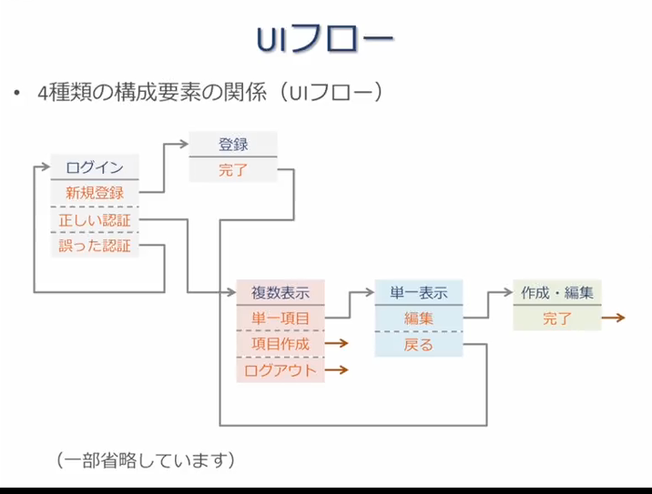

# 情報インターフェースデザイン
## デザインはデザイナーだけがやるものか？
### デザインの目的  
システム開発におけるデザインの極意は**正しく問題を解決する**ことである  
- 利用者は、機能やソリューションを欲しがる  
  - 何故それを欲しがるの  
    - 繰り返し、質問を続ける  
  - ユーザーの現状を良く理解する必要がある  

### 業務システム開発とデザイン  
正しく問題を解決するには、ユーザーのことを良く理解し、ソリューションを最適な方法で実装し、ユーザーへ展開しなければならない

### 要件定義
- ユーザーは誰か
- どのようなユースケースか  
- どのようなソリューションを提供するのか  

### 開発・テスト
- 機能要件/非機能要件を、最適な方法で実装する  
  - 何を以て最適とするのか => ユーザーは誰か  

### リリース
- 実際に使い始めるユーザーへのトレーニング  
  - 業務がどのように変わるのかを理解してもらえるか
  - エンドユーザーが違和感を覚える点はどこなのか、それは修正可能なのか

デザインについて考えるのはデザイナーだけ、ではない  
**どんなに優れたデザイナーでも、ユーザーへの理解がなければ、最適なデザインはできない**

## UI設計
### システムの構成要素
多くのシステムは4種類の要素から構成されている  

1.  複数項目の一覧表示  
    複数の記事・写真・動画等の一覧表示(リスト,サムネイル)  
    ex.) 検索結果の表示, 時系列データの表示, 複数データの俯瞰

2.  単一項目の表示  
    単一の記事・写真・動画等の表示  

3.  項目の作成,編集  
    記事などの登録・作成・編集  

4.  作業の支援  
    残りの各種画面(ログイン,設定,アカウント登録等)

### UIフロー
4種類の構成要素の関係をフロー化する  
画面遷移図等と呼ばれることもある  

## 階層型
多くのシステムは、階層的にコンテンツ・要素を構成している

- 例  
  - Amazon  
    本: コンピュータ・IT: プログラミング: HTML  
  - Yahoo! News  
    写真: エンタメorスポートor国内...etc  
  - Google Chrome  
    ウィンドウ: タブ: Webページ

- 通常、操作の影響はタブ内部に限定される  
  タブを削除すれば、下位の要素が一緒に削除される  

### 階層の注意事項
- 階層が浅いほうがクリック数は減る  
  しかし、階層を浅くするには一項目当たりの横幅が大きくなり、各レベルで考慮する要素数が増加する

- 要素のグループ分け  
  あるレベルで考慮すべき要素が多い場合は、グループ分けをしたり要素を順番に並べると良い

### Exercise
- 自身が業務で開発・保守するシステムのユーザー、ユースケースについて理解してください。  
  またその理解を更に深めるために、どのような情報・知識が必要かを整理してください。
- デザイナーがユーザー調査の際に用いる手法を調べてください。
- 自身が業務で開発・保守するシステムの各ページの要素を整理してください。
