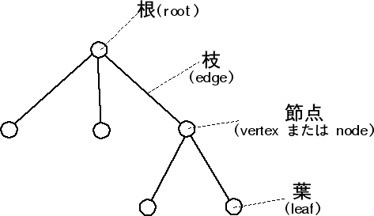

# Webの基礎知識
Webは1980年代にCERNのティム・バーナーズ=リーによって基本的なコンセプトが提案されたハイパーテキストシステムである。  
特に2000年代にGoogleが検索エンジンを開発したことにより、Webは爆発的に広まり、今日では社会にとって欠かせない情報インフラ基盤としての役割を果たしている。  
ここでは、Webの基礎知識として、Webを支える技術の紹介と、理解を深めるための課題を記載する。  

## インターネットブラウザーとHTML
GoogleやFacebook、Twitterといった種々のWebサイトは、全て**HTML**というマークアップ言語を用いて作成されている。  
HTMLとはHypter Text Markup Languageの略称であり、Webページを作成することを目的に設計された言語である。  

以下に、HTMLを使って作成された文書の例を記載する。(ソース: Wikipedia)

```html
<!DOCTYPE html>
<html lang="ja">
 <head>
  <meta charset="UTF-8">
  <link rel="author" href="mailto:mail@example.com">
  <title lang="en">HyperText Markup Language - Wikipedia</title>
 </head>
 <body>
  <article>
   <h1 lang="en">HyperText Markup Language</h1>
   <p>HTMLは、<a href="http://ja.wikipedia.org/wiki/SGML">SGML</a>
      アプリケーションの一つで、ハイパーテキストを利用してワールド
      ワイドウェブ上で情報を発信するために作られ、
      ワールドワイドウェブの<strong>基幹的役割</strong>をなしている。
      情報を発信するための文書構造を定義するために使われ、
      ある程度機械が理解可能な言語で、
      写真の埋め込みや、フォームの作成、
      ハイパーテキストによるHTML間の連携が可能である。</p>
  </article>
 </body>
</html>
```

例えばwordを用いて文書を作成する場合、各段落の見出しをつけるために以下のような操作を行うことができる

- 見出し文字のポイントを大きくする  
- 文字に下線を付ける
- 文頭を出す  

これらの操作を行なうことで、何も変更を加えていない時と比べて、文章を視覚的に整理して表示する効果が期待できる。

これをWebに置き換えて考えると、例えばブログを書く時に、wordと同じように文章の体裁を視覚的に整えるための機能が、求められる。
wordの場合は、リボンから行いたい操作を選ぶことでこれを実現するが、HTMLの場合は**タグ**で文書を囲むことで、これを実現する。

上記のHTMLのサンプルコードに記載されている、以下のコードを例とする。

```html
   <h1 lang="en">HyperText Markup Language</h1>
```

ここでは[HyperText Markup Language]という文書を```<h1>```というタグで囲んでいる。  
```<h1>```で囲まれた文書は、見出しとして扱われ、通常の文章と比べて文字が大きくなる等の効果が得られる。  
このHTMLは、インターネットブラウザ上では以下のように表示される。

   <h1 lang="en">HyperText Markup Language</h1>

インターネットブラウザーは、この**タグ**によって、文書に対して視覚的な効果を与える機能を有している。  
また文書に対して効果を与えるにとどまらず、画像を貼付したり、他のWebページへのリンクを作成することも、タグを用いることで実現できる。  

### Excercise
- このテキストはHTMLを用いて記述されている。このHTML内で使用されているタグと、その意味合いを調べてみてください。
- [MDNのサイト](https://developer.mozilla.org/ja/docs/Web/HTML/Reference "MDN") を参照し、この他にどのようなタグがHTMLでは使えるのかを調べてください。  

- 以下の要素を持つ、架空のブログをHTMLを使って作成してください。  ※CSS等による装飾は不要  

1.  ブログ記事  
  1-1.  タイトル  
  1-2.  本文  
    1-2-1.  文書  
    1-2-2.  画像  
  1-3.  コメント  
    1-3-1.  ユーザー名  
    1-3-2.  タイトル  
    1-3-3.  本文  

## HTML/CSS/Javascript
HTMLとインターネットブラウザーの項では、文書をタグで囲むことで、視覚的な効果を与えることができることを確認した。  
しかし、タグを用いるだけでは、テキストに色をつけたり、アニメーションを追加するなどの効果を与えることはできない。  
この項では、こうした効果を追加するための言語、機能であるCSSとJavascriptについて記載する。

### HTMLのタグの意味
ここまでの説明では、HTMLのタグを用いることで、文書へ視覚的な効果を与えることができるとしてきた。  
しかしHTMLのタグの本来の意味は**文書の構造化**であり、視覚的な効果はその補助的なものになる。  

先の項で記載したHTMLサンプルでは、以下のような構造化がされている

- article: 記事
  - h1: 見出し
  - p: 文書
    - a href: リンク

このような、ある要素に対して子要素が紐付き、その子要素に更に子要素が紐付き…という構造のことを総称して**木構造**と呼ぶ。
図にすると以下のようになる。  



HTML文章の構造は、このように木構造となっている。このHTML文章の木構造のことを**DOMツリー**と呼ぶ。  
DOMはDocument Object Modelの略称である。  

### Exercise
- このテキストのDOMツリーを、樹形図で表してください。  
- プロダクトロケーターのメイン画面のDOMツリーを、樹形図で表してください。

※全ての要素を挙げきる必要はありません。ページ全体の要素が、ある程度把握できるレベルで問題ありません。

## CSSによるDOMツリーの操作
HTMLはタグを用いることで、DOMツリーと呼ばれる、文書の構造化を行なうことができる。  
しかし現実には、あるときは見出しを赤文字かつ太文字で記述する効果が好まれることもあれば、太文字と下線による効果が好まれることもある。  
このように、DOMツリー内の特定のDocument Objectに対して、任意の視覚的効果を与える機能を有するのが、CSSである。

### CSS
CSSとは、Cascading Style Sheetの略称である。HTMLで記述された文書の体裁や見栄えなどの視覚的効果を表現するために用いられるスタイルシート言語である。  
先程の例の、pタグで囲まれた文書に対して、青字と下線の効果を加えるのが以下のサンプルである。

```html
<!DOCTYPE html>
<html lang="ja">
 <head>
  <meta charset="UTF-8">
  <link rel="author" href="mailto:mail@example.com">
  <title lang="en">HyperText Markup Language - Wikipedia</title>
 </head>
 <body>
  <article>
   <h1 lang="en">HyperText Markup Language</h1>
   <p class="cssTest">HTMLは、<a href="http://ja.wikipedia.org/wiki/SGML">SGML</a>
      アプリケーションの一つで、ハイパーテキストを利用してワールド
      ワイドウェブ上で情報を発信するために作られ、
      ワールドワイドウェブの<strong>基幹的役割</strong>をなしている。
      情報を発信するための文書構造を定義するために使われ、
      ある程度機械が理解可能な言語で、
      写真の埋め込みや、フォームの作成、
      ハイパーテキストによるHTML間の連携が可能である。</p>
  </article>
 </body>
 <style>
  p.cssTest {color: blue; text-decoration: underline;}
 </style>
</html>
```

### Exercise
- 上記のhtmlを実際にブラウザで表示し、どのような効果が与えられているかを確認してください。  
- 先程作成した架空のブログへ、CSSを使って視覚的効果を付与してください。

## Javascript
Javascriptは、プログラミング言語の１つである。Javaと名前が似ているが、関係性はない。  
Javascriptは、他のプログラミング言語とは異なり、インターネットブラウザー上で動作する。  
換言すれば、インターネットブラウザー上で動作するアニメーションやDOMの制御はJavascript(とCSS)以外では行えないということになる。よって、Webサイトやアプリケーションを開発する際には必ず使用する言語である。よって、これを理解することは非常に重要である。  
以下、Javascirptの言語仕様と、DOM操作について記載する。  

## プログラムの実行環境と開発環境
全てのプログラムは、PCやサーバーといった、何がしかのコンピューター上で動作する。  
また同様に、全てのプログラムは最終的にはバイナリ(0,1)に変換され、実行される。  
Javascriptについて触れる前に、プログラムがどのように実行されるのかという流れについて、概要を記載する。  

### プログラムの実行環境
プログラムを最終的に実行するのはCPUである。  
CPUは命令セット(Instruction Set)と呼ばれる、命令を伝えるための語彙を持つ。この命令セットは、開発元の企業や、CPUの用途などにより、様々な種類が存在する。

```
命令セット
↓ ← CPUが解釈、変換
実行
```

要するに、CPUに処理を渡すためには、命令セットを渡す必要があるということになる。(厳密には、CPUへこれを直接渡すのではなく、OSがそれを管理する)  
命令セットの実態はバイナリ(0/1)である。極論を言えば、0/1の羅列を正しく書ききれば、CPUに命令を実行させることはできるということになる。ただし大変な労力を要する。しかし、実際に1960年代などは人間がこれを記述することで、CPUを動かしていた。

Javascript、PHPといったプログラミング言語は、このように人間が0/1を記述する労力を軽減するために、人間が理解しやすい文字列を、最終的にこのようなバイナリへ変換する機能を有している。この変換を担うのが**コンパイラ**と呼ばれる機能である。  

```
プログラミング言語
↓ ←コンパイラが解釈、変換
命令セット ←CPUが解釈、実行
↓
実行
```

コンパイラのように、プログラミング言語をCPUに実行させるために必要な機構を総称して**プログラムの実行環境**と呼ぶことが多い。実行環境がなければ、どんなに良く書かれたソースコードでも、CPUにそれを実行させることはできない。  

### Javascriptの実行環境
Javaを実行するためにはJVMが必要である。Oracleは「30億のデバイスで動くJava」というキャッチフレーズをよく使う。これを言い換えると、世界中の30億のデバイスにはJVMがインストールされているということになる。  

```
Java
↓ ← JVMがコンパイル
JVM命令セット ← JVMが解釈
↓
命令セット ← CPUが解釈、実行
↓
実行
```

最初に、Javascriptはインターネットブラウザー上で動作すると記載した。これを言い換えると**Javascript→命令セットへの変換はインターネットブラウザーが行っている**ということである。

```
Javascript
↓ ← インターネットブラウザーが解釈、変換
命令セット ← CPUが解釈、実行
↓
実行
```

### 開発環境:インターネットブラウザーを使ってJavascriptを書く
上述の通り、Javascriptの主な動作環境はインターネットブラウザーである。  
開発環境とは、実行環境+ソースコードを書くためのツール、のセットをことを示す。
JavaであればJVMに対応したエディタ(eclipseなど)を使用してソースコードを書く。  

Javascriptの場合、様々な方法があるが

1.  インターネットブラウザー上で書き、実行する  
2.  任意のテキストエディターを使って書き、実行する

の2通りが挙げられる。

#### インターネットブラウザー上で書く&実行する
多くのインターネットブラウザーには、ブラウザー上でJavascriptを直接書き込み、実行するための環境が用意されている。  
このような環境を総称してplaygroundと呼ぶ。 

#### 任意のテキストエディターを使って書き、実行する
Javascriptをブラウザ上のplayground環境以外で動かす(つまりユーザーと同等の方法で動かす)ためには、htmlを経由する必要がある。  

- index.html

```html
<!DOCTYPE html>
<html lang="en">
<head>
    <meta charset="UTF-8">
    <title>Title</title>
</head>
<body>
<script type="text/javascript" src="./scripts/index.js" ></script>
</body>
</html>
```

- index.js

```javascript
console.log('hello world');
```

- フォルダ階層

```
- index.htm;
- scripts
 |- index.js
```

この状態でindex.htmlを起動すると、`<script type="text/javascript" src="./scripts/index.js" ></script>`が実行される。  
scriptタグは、`src`にあたえられているスクリプトを読み込み、実行する。  
ここで、index.jsが実行され、Consoleへ`hello world`が出力される。  

以下、Javascriptの動作確認を行なう際は、このようにhtmlからjavascriptを呼び出す方法を前提とする。  

### Javascriptの言語仕様
#### 変数・定数
変数とはプログラム中の値を保持して置くためのものである。
JavaScriptでの変数とは一般的に、以下のように定義する。

```javascript
var sum = 21; // サイコロの眼の合計
const count = 6; // サイコロの目の数
var avg = 21 / count; // サイコロの目の平均値
```

#### 制御構文
if文を使用することで、条件分岐を行なうことができる。  

```javascript
var min = 1; // サイコロの目の最小値
var max = 6; // サイコロの目の最大値
var a = Math.floor( Math.random() * (max + 1 - min) ) + min ; // 1 〜 6の値をランダムに返す

if (a % 2 === 0) { // 2で割った余りが0の場合
    console.log(a + ": 偶数");
} else {
    console.log(a + ": 奇数");
}
```

for文を使用することで、繰り返し処理を行なうことができる。  

```javascript
for (var i = 0; i < 10; i++){
    console.log("for loop count: " + i);
}
```

#### Exercise
- if文以外のJavascriptの制御構文を使って、任意の値を出力するプログラムを書いてください
  - while
  - switch

- 以下のプログラムを作成してください
  - `1〜100までのループの中で、フィボナッチ数列を出力する`
  - `1〜100までのループの中で、ループ数が3で割り切れる場合は"Fizz"、ループ数が5で割り切れる場合は"Buzz"、15で割り切れる場合は"FizzBuzz"と出力する"`

### 配列
Javascriptにはint,string,boolean等、様々な型が存在する。  
この中で特に重要なのが、**配列**と呼ばれる、可変長の項目を格納できる型である。  

```
var array = [1,2,3,4,5,6];
console.log(array); //  [1, 2, 3, 4, 5, 6]

var product1 = {code: "123456789" , name: "ミッキーマウス セーター"} // 連想配列
var product2 = {code: "123456780" , name: "ミ二ーマウス セーター"}
var product3 = {code: "123456781" , name: "ジェラトーニ セーター"}
var product4 = {code: "123456782" , name: "ドナルド セーター"}
var product5 = {code: "123456783" , name: "シンデレラ セーター"}
var product6 = {code: "123456784" , name: "白雪姫 セーター"}

var products = [product1, product2, product3, product4, product5, product6];

for (var i = 0; i < products.length; i++ ){
    console.log(products[i]);
}

```

配列は、DBやAPIから取得する可変長の値を格納し、まとめて扱うことができる。  
Javascriptに限らず、多くのプログラミング言語にて、配列は多用する。  

#### Exercise
- 自身が業務で開発・保守するシステムにて、配列を扱って表現できる要素を調べてください
- 以下のプログラムを作成してください
  - `[1,2,3,4,5,6]`の合計値を求めるプログラムを、for文と配列を使って記述してください`
  - サイコロの出る目を期待値を求めるプログラムを記述してください (すべての目がでる確率は同一とする)
