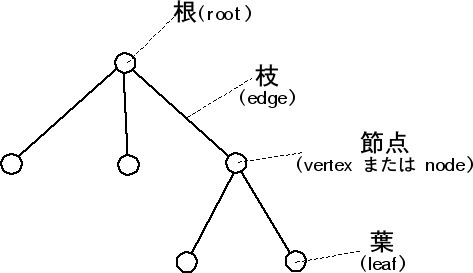

# Webの基礎知識
Webは1980年代にCERNのティム・バーナーズ=リーによって基本的なコンセプトが提案されたハイパーテキストシステムである。  
特に2000年代にGoogleが検索エンジンを開発したことにより、Webは爆発的に広まり、今日では社会にとって欠かせない情報インフラ基盤としての役割を果たしている。  
ここでは、Webの基礎知識として、Webを支える技術の紹介と、理解を深めるための課題を記載する。  

## インターネットブラウザーとHTML
GoogleやFacebook、Twitterといった種々のWebサイトは、全て**HTML**というマークアップ言語を用いて作成されている。  
HTMLとはHypter Text Markup Languageの略称であり、Webページを作成することを目的に設計された言語である。  

以下に、HTMLを使って作成された文書の例を記載する。(ソース: Wikipedia)

```html
<!DOCTYPE html>
<html lang="ja">
 <head>
  <meta charset="UTF-8">
  <link rel="author" href="mailto:mail@example.com">
  <title lang="en">HyperText Markup Language - Wikipedia</title>
 </head>
 <body>
  <article>
   <h1 lang="en">HyperText Markup Language</h1>
   <p>HTMLは、<a href="http://ja.wikipedia.org/wiki/SGML">SGML</a>
      アプリケーションの一つで、ハイパーテキストを利用してワールド
      ワイドウェブ上で情報を発信するために作られ、
      ワールドワイドウェブの<strong>基幹的役割</strong>をなしている。
      情報を発信するための文書構造を定義するために使われ、
      ある程度機械が理解可能な言語で、
      写真の埋め込みや、フォームの作成、
      ハイパーテキストによるHTML間の連携が可能である。</p>
  </article>
 </body>
</html>
```

例えばwordを用いて文書を作成する場合、各段落の見出しをつけるために以下のような操作を行うことができる

- 見出し文字のポイントを大きくする  
- 文字に下線を付ける
- 文頭を出す  

これらの操作を行なうことで、何も変更を加えていない時と比べて、文章を視覚的に整理して表示する効果が期待できる。

これをWebに置き換えて考えると、例えばブログを書く時に、wordと同じように文章の体裁を視覚的に整えるための機能が、求められる。
wordの場合は、リボンから行いたい操作を選ぶことでこれを実現するが、HTMLの場合は**タグ**で文書を囲むことで、これを実現する。

上記のHTMLのサンプルコードに記載されている、以下のコードを例とする。

```html
   <h1 lang="en">HyperText Markup Language</h1>
```

ここでは[HyperText Markup Language]という文書を```<h1>```というタグで囲んでいる。  
```<h1>```で囲まれた文書は、見出しとして扱われ、通常の文章と比べて文字が大きくなる等の効果が得られる。  
このHTMLは、インターネットブラウザ上では以下のように表示される。

   <h1 lang="en">HyperText Markup Language</h1>

インターネットブラウザーは、この**タグ**によって、文書に対して視覚的な効果を与える機能を有している。  
また文書に対して効果を与えるにとどまらず、画像を貼付したり、他のWebページへのリンクを作成することも、タグを用いることで実現できる。  

### Excercise
- このテキストはHTMLを用いて記述されている。このHTML内で使用されているタグと、その意味合いを調べてみてください。
- [MDNのサイト](https://developer.mozilla.org/ja/docs/Web/HTML/Reference "MDN") を参照し、この他にどのようなタグがHTMLでは使えるのかを調べてください。  

- 以下の要素を持つ、架空のブログをHTMLを使って作成してください。  ※CSS等による装飾は不要  

1.  ブログ記事  
  1-1.  タイトル  
  1-2.  本文  
    1-2-1.  文書  
    1-2-2.  画像  
  1-3.  コメント  
    1-3-1.  ユーザー名  
    1-3-2.  タイトル  
    1-3-3.  本文  

## HTML/CSS/Javascript
HTMLとインターネットブラウザーの項では、文書をタグで囲むことで、視覚的な効果を与えることができることを確認した。  
しかし、タグを用いるだけでは、テキストに色をつけたり、アニメーションを追加するなどの効果を与えることはできない。  
この項では、こうした効果を追加するための言語、機能であるCSSとJavascriptについて記載する。

### HTMLのタグの意味
ここまでの説明では、HTMLのタグを用いることで、文書へ視覚的な効果を与えることができるとしてきた。  
しかしHTMLのタグの本来の意味は**文書の構造化**であり、視覚的な効果はその補助的なものになる。  

先の項で記載したHTMLサンプルでは、以下のような構造化がされている

- article: 記事
  - h1: 見出し
  - p: 文書
    - a href: リンク

このような、ある要素に対して子要素が紐付き、その子要素に更に子要素が紐付き…という構造のことを総称して**木構造**と呼ぶ。
図にすると以下のようになる。  



HTML文章の構造は、このように木構造となっている。このHTML文章の木構造のことを**DOMツリー**と呼ぶ。  
DOMはDocument Object Modelの略称である。  

### Exercise
- このテキストのDOMツリーを、樹形図で表してください。  
- プロダクトロケーターのメイン画面のDOMツリーを、樹形図で表してください。

※全ての要素を挙げきる必要はありません。ページ全体の要素が、ある程度把握できるレベルで問題ありません。

## CSSによるDOMツリーの操作
HTMLはタグを用いることで、DOMツリーと呼ばれる、文書の構造化を行なうことができる。  
しかし現実には、あるときは見出しを赤文字かつ太文字で記述する効果が好まれることもあれば、太文字と下線による効果が好まれることもある。  
このように、DOMツリー内の特定のDocument Objectに対して、任意の視覚的効果を与える機能を有するのが、CSSである。

### CSS
CSSとは、Cascading Style Sheetの略称である。HTMLで記述された文書の体裁や見栄えなどの視覚的効果を表現するために用いられるスタイルシート言語である。  
先程の例の、pタグで囲まれた文書に対して、青字と下線の効果を加えるのが以下のサンプルである。

```html
<!DOCTYPE html>
<html lang="ja">
 <head>
  <meta charset="UTF-8">
  <link rel="author" href="mailto:mail@example.com">
  <title lang="en">HyperText Markup Language - Wikipedia</title>
 </head>
 <body>
  <article>
   <h1 lang="en">HyperText Markup Language</h1>
   <p class="cssTest">HTMLは、<a href="http://ja.wikipedia.org/wiki/SGML">SGML</a>
      アプリケーションの一つで、ハイパーテキストを利用してワールド
      ワイドウェブ上で情報を発信するために作られ、
      ワールドワイドウェブの<strong>基幹的役割</strong>をなしている。
      情報を発信するための文書構造を定義するために使われ、
      ある程度機械が理解可能な言語で、
      写真の埋め込みや、フォームの作成、
      ハイパーテキストによるHTML間の連携が可能である。</p>
  </article>
 </body>
 <style>
  p.cssTest {color: blue; text-decoration: underline;}
 </style>
</html>
```

### Exercise
- 上記のhtmlを実際にブラウザで表示し、どのような効果が与えられているかを確認してください。  
- 先程作成した架空のブログへ、CSSを使って視覚的効果を付与してください。
