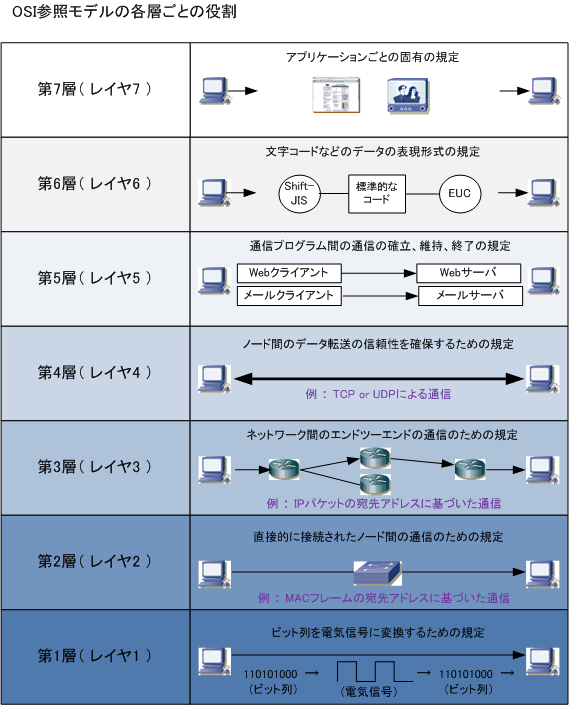

# HTTP
HTTP(Hyper Text Transfer Protocol)とは、HTML等のファイルの送受信に使われるプロコトルである。  
PCやスマートフォンから日常的に様々な用途で利用されているWebを支える中核技術の１つである。  
また業務アプリケーションに於いても、インターネットにつながっていないネットワーク内であったとしても、HTTP通信を用いた開発が主流である。  

HTTPの仕様は国際団体であるIETFがRFCという形で保存し、公開している。(https://tools.ietf.org/html/rfc2616)  
ここに記載されている仕様のうち、特に重要な部分について取り上げる。  
なお詳細については、基本情報技術者試験のテキスト等を通して学習することを前提とする。  

[基本情報技術者試験](https://www.jitec.ipa.go.jp "基本情報技術者試験")

基本情報技術者試験は、HTTPに限らず、IT業界で働く上で必要となる知識の基礎的な部分を問う試験である。  
運営元は経済産業省の外郭団体であるIPAであり、信頼性が高い。  
受験料が5000〜6000円ほどかかるが、合格すれば受験料について会社から還付される制度も存在するため、受験することを推奨する。

## HTTPとは
RFC2616のAbstractには、以下のように記述されている。

```
The Hypertext Transfer Protocol (HTTP) is an application-level protocol for distributed, collaborative, hypermedia information systems.  
It is a generic, stateless, protocol which can be used for many tasks beyond its use for hypertext, such as name servers and distributed object management systems, through extension of its request methods, error codes and headers [47]. A feature of HTTP is the typing and negotiation of data representation, allowing systems to be built independently of the data being transferred.
```

Google日本語訳を通すと、以下のように翻訳される。

```
ハイパーテキスト転送プロトコル（HTTP）は、分散型、共同型、ハイパーメディア情報システム向けのアプリケーションレベルのプロトコルです。   
これは、ネームサーバや分散オブジェクト管理システムなど、ハイパーテキストを使用する以外にも、リクエストメソッド、エラーコード、ヘッダーの拡張など、多くのタスクで使用できる汎用のステートレスプロトコルです[47]。 HTTPの特徴は、データ表現のタイプとネゴシエーションであり、転送されるデータとは独立してシステムを構築することができます。
```

おそらくこれを読んだだけで理解できる初学者はいないと思われる。  
以下、可能な限り平易な解説を記載する。  

### プロコトルとは
HTTPは**プロコトル**の１つである。プロコトルとは、コンピュータシステムでデータ通信を行うための**規約**であり情報フォーマット、交信手順を定めている。  
よく用いられる例えとして、人間のコミュニケーションが挙げられる。人間は言語に依ってコミュニケーションを行なうことができるが、これは文字、単語、文法といった規約が存在し、それが日本語、英語、フランス語といった形で存在することが前提となっている。各々が思うがままに口から音を発しているだけでは、言語によるコミュニケーションは行えない。  
コンピューター同士でデータ通信を行なう際にも、同じことが言える。具体的には、テキストをやり取りする時の文字コード指定はどこで行なうのか(HTTPヘッダー)、通信が失敗したことを通知する時にそれがどのような理由で失敗したことをどのように示すのか(HTTPステータスコード)、そもそもネットワーク帯域が限られている中で伝送効率を高めるためにはどのようなロジックが適切なのか(HTTP全般)、といった「決めの問題」を扱わなければならない。これについて、国際的に合意が取られ、標準として利用されているのがHTTPの特徴である。  

### HTTP以外のプロコトル
言語にも日本語、英語といった複数のプロコトルが存在するように、データ通信にも様々なプロコトルが存在する。  
またデータ通信プロコトルの特徴として、**プロコトル同士が階層のような関係性を有している**ことが挙げられる。  
この階層を説明する際によく用いられるのがOSI参照モデルである。  



このようにデータ通信のプロコトルはそれぞれ階層を構成するような関係性を有している。  
具体的に言えば、HTTPという通信プロコトルは、その下にTCP/IPやeternetといったプロコトルが存在し、これらのプロコトルで通信が行われることを前提としている。  
一般的に、ネットワークでトラブルが発生した時は、この階層の下の方から疎通確認を行なう事が多い。  
(例: LANや無線LANはつながっているか -> pingは通るか(tcp/ip層の確認) -> IPアドレス直接指定でサイトが見えるか(DNSの確認) -> ポート80の通信は通るか(HTTPの確認))

以下、HTTP通信を行なうために必要となるプロコトルと、データ通信を行なうために存在するHTTP以外のプロコトルについて、記載する。

#### Ethernet
Ethernet(イーサネット)は、世界中のオフィスや家庭で一般的に使用されている有線のLAN (Local Area Network) で最も使用されている技術規格で、OSI参照モデルの下位2つの層である物理層とデータリンク層に関して規定している。  
具体的には、0/1のデジタルデータをどのように電気信号に変換するのかという部分について規定している。

#### TCP/IP
データ通信は**パケット**と呼ばれる単位で行われる。あるデータを送受信する際にエラーが発生した場合、すべてのデータを再送信することは通信帯域の浪費につながるため、エラーが発生したパケットのみを再送信することがプロコトルとしては望ましい。TCP/IPは、データをどのようにパケットに変換するのか、またデータの内容を表すメタ情報をパケットに変換するのか、それぞれのパケットをどのような順番で送るのか、といった規約を定めている。  
TCP/IPの特徴として、IPアドレスと呼ばれる、あるネットワーク内において一意であるアドレスを用いて通信を行なうことが挙げられる。

#### DNS
TCP/IPでの通信の際はIPアドレスを用いる。IPアドレスは`192.168.2.252`といった、自然数の組み合わせによって記述される。  
例えばGoogleへアクセスしたいと考えた時に、このIPアドレスを直接ブラウザに入力することは不可能ではないが、非常に煩雑になる。  
そこで、人間に理解しやすい`https://www.google.co.jp/`といった文字列を、このIPアドレスに変換することで、人間がIPアドレスを覚える手間を省くことを目的としているのが、DNSである。  
機能上の特性から**名前解決**といった呼称も存在する。  
機能的には一見地味に見えるが、実はDNSサーバーがダウンするとほぼ全てのHTTP通信が不通になる、重要な機能である。  

#### SSH
SSHは、TCP/IPを前提とした、暗号や認証の技術を利用して、安全にリモートコンピュータと通信するためのプロトコルである。パスワードなどの認証部分を含むすべてのネットワーク上の通信が暗号化される。  
TCP/IP通信は、あるサーバーとあるサーバーが通信を行う際に、様々な場所にある複数のルーターを経由しても通信が行えるプロコトルである。実際に、日本にあるPCからアメリカのデータセンターにあるサーバーへアクセスするといったことが容易に実現できる。  
一方で、ルーターは自分自身へのアクセス内容を全て保存することができる。例えばFacebookへログインする際の通信が、このルーターに保存されていた場合、世界中のユーザーのパスワードが流出してしまうことにつながる。  
このように、コンピューター間通信を経由するコンピューター(ルーター等)から通信内容を秘匿する方法として、**共通/公開鍵暗号方式**が存在する。暗号方式の詳細についてはここでは割愛するが、SSHはこの方式を用いることで、通信内容を暗号化している。  
SSHは主に、対象のサーバーやPC等に対して、ソフトウェアをインストールしたり、プロセスを再起動したり、OSをシャットダウンするといった操作を行なう際によく用いられる。  
日本ではTeratermというソフトウェアがよく使われる。このソフトウェアは当時理化学研究所に勤務していた寺西高によって開発された。

### Excercise
- FTPという通信プロコトルについて、仕様を調査し、整理してください
- 任意のLinuxサーバーへSSHをインストールし、teratermで接続してください

## HTTP
ここまで、HTTPが前提としているコンピューター通信のプロコトルについて記載してきた。  
以降は、HTTPについて、その内容を深掘りしていく。 

### URI(L)
URIとは、Universal Resource Identifier(Locator)の略称である。  
構文は以下の通り。  

```
 http_URL = "http:" "//" host [ ":" port ] [ abs_path [ "?" query ]]
```

URLによって、HTTPプロコトル経由でネットワークリソースの位置を一意に特定することができる。  
例として、TwitterのURLは
```
https://twitter.com/
```
となっている。この`twitter.com`は、上記の構文の`host`に該当し、接続先のサーバー、サービスを識別するために使用する。  
またこのURL`port`の指定を行っていない。`port`とは、TCP/IPが持つ仕様で、OSI参照モデルのアプリケーション層の通信を区別するために使用する。  

例えばWebサーバーをAWS上で構築したとする。ApacheのインストールはSSHで行い、htmlのアップロードにはFTPを使用し、最終的にHTTPでサーバーを公開するとする。  
IPアドレスに依って接続先のサーバーを区別することはできるが、**どのプロコトルを使って通信するのか**を表すことができない。  
そこでSSHは22、FTPは16、HTTPは80といったように、各プロコトルに番号を割り振り、接続する際はIPアドレスとポートを使うことで、どのサーバーへどのプロコトルを使って接続するのかを一意に識別することができる。この番号のことをポート(番号)と呼ぶ。  

上記のURLはHTTPS(443)を用いている。これは
```
https://twitter.com:443/
```
と同じ意味合いを持つ。
インターネットブラウザーはURLの先頭にプロコトル宣言(`http://`の部分)があるが、teratermやftpクライアントで接続する際は、このようなプロコトル宣言ではなく、  
```
twitter.com:22
```
といったように、ポート番号をURLないしはIPアドレスの後ろに付与する方式が用いられている。  

次は、TwitterのあるツイートのURLを見る。  
```
https://twitter.com/realDonaldTrump/status/898870621584596993
```
このツイートはアメリカ大統領のドナルド・トランプが、大統領首席補佐官であったスティーブ・バノンをクビにした時のツイートである。  
まさに泣いて馬謖を斬るという故事が当てはまる(?)ツイートだが、ここではこのURLに着目する。  
これを見ると、TwitterのURLは
```
https://twitter.com/<アカウント名>/status/<ツイート番号>
```
という構文であるように見える。また、このアカウントのlikeのページは
```
https://twitter.com/realDonaldTrump/likes
```
というURLであった。この`likes`というのが、良いね一覧ページへのURLであるようだ。  
URL(I)は、このように**どのリソース(ページ)へアクセスするのか**といった情報を、階層的に表現することができる。  
URL自体はただの文字列であるため、開発者の自由に設定することができる。しかしTwitterのように直感的に理解しやすいURLは、Webサイトの保守性や拡張性を高める効果がある。  

### HTTPメッセージ
HTTPメッセージは、クライアントからサーバへのリクエストと、サーバからクライアントへのレスポンスから成る。
```
 HTTP-message   = Request | Response     ; HTTP/1.1 messages
```
リクエストとレスポンスの各メッセージは、エンティティ (メッセージの付加物) を転送するためにRFC 822の一般的なメッセージフォーマットを使用する。   
両タイプとも、開始行、0 以上のヘッダフィールド ("headers"として知られているもの)、ヘッダフィールドの終了を示す (CRLF の前に何もない行のような) 空行、そして任意のメッセージボディからなる。  

### メッセージヘッダ


### メッセージボディ

### ステートレス
#### リクエスト

#### レスポンス

### 課題
- 情報インターフェースの項で扱った"システムの構成要素"のうち、`複数項目の一覧表示`、`単一項目の表示`、`項目の作成,編集`の3種について、それぞれどのようなURLを設定するか考えてください。  
 - 以前の課題で考えた架空のブログサービスの画面遷移図と、URLを紐付けてください。記事やブログ主などの要素を足したり削ったりして構いません。
   - ヒント: 一般的に、一覧表示は`index`、単一項目の表示は`view`、項目の作成、編集は`edit`という単語を用いて表すことが多いです。(RESTful設計)
   
   


