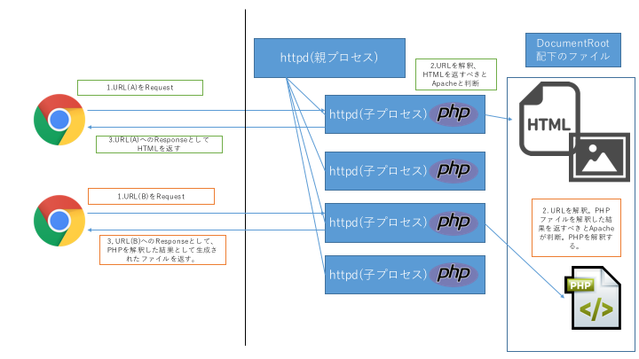

# PHP
Wikipediaより引用。

```
PHP（ピー・エイチ・ピー）は "The PHP Development Team" によってコミュニティベースで開発されているオープンソースの汎用プログラミング言語であり、  
特にサーバーサイドで動的なウェブページ作成するための機能を多く備える。   
名称の PHP は再帰的頭字語である "PHP: Hypertext Preprocessor" を意味し、「PHPはHTMLのプリプロセッサである」とPHP自身を再帰的に説明している。   
元々は「個人的なホームページ」を意味する英語の "Personal Home Page" に由来し、プログラムが大きく書き直されたバージョン3から現在の意味となった。
```

PHPはWebサイトを開発することを目的に、カナダ人のラスマス・ラードフによって設計、実装された。  
PHPという言語は良い意味でも悪い意味でも持て囃されてきた。IPAの「セキュアプログラミング講座」の一節は多くの波紋を呼んだ。

```
(1) プログラミング言語の選択
1) 例えば、PHPを避ける
短時日で素早くサイトを立ち上げることのみに着目するのであれば、PHPは悪い処理系ではない。  
しかし、これまで多くの脆弱性を生んできた経緯があり、改善が進んでいるとはいえまだ十分堅固とは言えない。
```

当然ではあるが、PHPで書かれたWebサイトは全て脆弱性があるということはありえない。  
Facebook, メルカリといったメジャーなWebサービスでもPHPはコア言語として採用されており、PHPで堅牢かつ高速なWebアプリケーションを開発することは決して難しいものではない。  
少なくともWebアプリケーション開発であれば、「PHPだから」という理由でできないことはほとんど無いといっても過言ではない。  

## PHPの制御構文、シンタックス
PHPは世界中のWebサイトで使われている。これはつまりPHPを覚えるためのチュートリアル等も豊富に準備されているということにつながる。  
従って、ここでは筆者が分かりやすいと感じるPHPのチュートリアルについて記載するに留める。  

- ドットインストール  
  `http://dotinstall.com/lessons/basic_php_v2`  
  言わずと知れたプログラミング入門サイト。

- パーフェクトPHP  
  `https://www.amazon.co.jp/dp/B00P0UDWQY/ref=dp-kindle-redirect?_encoding=UTF8&btkr=1`  
  PHPに関する書籍としては、これ1冊があればたいてい事足りる。

- 公式チュートリアル  
 `http://php.net/manual/ja/tutorial.php`  
  読みやすさやわかり易さという点では若干劣るものの、情報の正確性や鮮度では他の追従を許さない。  
  入門書や入門サイトで理解したあとでこのサイトを見ると、新たな発見があることが多い。  

### Exercise
- PHPでFizzBuzz問題を解いてください
- PHPでうるう年を判別するアルゴリズムを実装してください
- PHPで素数判定アルゴリズムを実装してください  
  - 素数判定に用いるアルゴリズムはなんでも良い(代表的なのはエラトステネスの篩)

## PHP with Apache
PHPはWebアプリケーション開発のために設計、実装されたと記載した。  
ただしPHP単体ではWebアプリケーションを開発することはできない。(※)  
何故なら、HTTP通信をハンドリングするためにはWebサーバーが必要となる。つまりPHPでWebアプリケーションを開発するためにはApacheとPHPを統合しなければならない。  

※厳密にはPHPビルトインサーバーを使えば不可能ではないが、それができる人間にはこのチュートリアルは不要である。よってここでは無視する。  

WebサーバーがHTMLを返すまでのフローは以下のように示せる。  
(引用: https://image.slidesharecdn.com/20120710phpbuild-120710052328-phpapp02/95/8-php-9-728.jpg?cb=1341898223)  


Apacheは、リクエストに含まれるURLやHTTPヘッダーフィールド、ボディフィールドの中身を解釈する機能を有している。  
ApacheはC言語で書かれている。極論、上記の情報を解釈し、必要であればDBへSQL発行及び結果を取得し、HTMLを生成するプログラムをC言語で書いてしまえば、  
Webアプリケーションを開発することはできる。ただしこれは大変な労力を必要とする。  

そこでApacheは、自身が解釈したリクエストに含まれるURLやHTTPヘッダーフィールド、ボディフィールドの中身を他の**処理系**(Tomcat,PHP等)へ引き渡すための拡張モジュールが用意されている。  
Tomcatであれば`mod_proxy_ajp`を使用する。PHPの場合は`mod_php`を使用する。以下、`mod_php`を有効化するために必要な環境について記載する。 
なおGoogleで`mod_php 設定`と検索することで多くのサイトがヒットするが、それらの大半が非常に簡略化された手順や、いわゆる「やってみた」系のサイトであることが大半であるため、  
サイトが前提としている環境とズレがあったり、情報が古い場合などに上手く進められないケースが往々にして発生する。  
ここでは`mod_php`を動かすために必ず必要な環境について記載する。この環境をどのようにインストールするのかについては、上記のサイトを参照すれば良い。

### PHPのインストール
当然ではあるが、ApacheとPHPを統合するためには`mod_php`以前に、PHPのインストールが必要となる。  
PHPのインストール方法は、大別して以下の2種類に分けられる。  

1.  コンパイル&ビルド  
  PHPという言語(処理系)はC言語で実装されている。  
  よって、PHPをインストールするためには、このC言語で書かれたソースコードをコンパイル&ビルドすれば良い。  
  この方法のメリットは最新版のPHPがインストールできること、デメリットはC言語の知識が必要であるため若干難易度が高いという点である。  

2.  パッケージマネージャ  
  大半のLinuxには何かしらのパッケージマネージャ及びツールがインストールされている。  
  CentOS/RHELであればyum,Ubuntuであればapt-get等が挙げられる。  
  このパッケージマネージャを使うことで、コンパイル&ビルド済みのバイナリを直接インストールすることができる。  
  デメリットとしては、パッケージマネージャ自体が有志の手による(ほぼ)無償の作業に依存するため、最新版への対応が遅れがちな点などが挙げられる。  

#### Exercise
- Windows/LinuxへPHP7をインストールしてください  
  インストール方法については、上記のどちらでも問題ありません

### mod_php


PHPはWebアプリケーションの開発で用いられることが多い。PHP以外にもWebアプリケーションを開発するためのスクリプト言語はPython,Ruby等、多数存在する。  
またスクリプト言語ではないものの、Java(Tomcat)を使用することも多い。  
このように、Webアプリケーションを開発する言語はPHP以外にも多数存在する。にも関わらずPHPが好まれてきた理由の１つとして**mod_php**の存在が挙げられる。  

Stackoverflowに記載されていた解説を和訳して引用する。(https://stackoverflow.com/questions/2712825/what-is-mod-php)

```
質問:  
Zend tutorialをやっていたら、『php_flagは、mod_phpが使われてれば、htaccessの中で設定することで動作する。』という一文を見ました。  
これってどういう意味ですか？

答え:  
mod_phpは、Apache moduleとしてのPHP処理系のことです。  
ざっくり言えば、mod_phpをApacheのモジュールとしてローディングすれば、ApacheはPHPファイルを解釈(interpret)できるようになります。  
(mod_phpによって解釈される)

Apache上でPHPを動かす方法には、少なくとも以下の２つがあります。  

- CGIを使う  
  PHP処理系がApacheによって起動され、これによってPHPファイルが解釈される。(Apache自体によってではない)  

- mod_phpを使う  
  PHPインタープリター(処理系)がApacheプロセス内に組み込まれている。  
  つありApache自身がPHPファイルを解釈する

どちらを用いるかについては、Apacheをどのように設定するかによって変わります。  

(以下省略)
```

mod_phpが好まれる理由として、以下が挙げられる。  

- PHPを処理するために、Apache以外のプロセスが不要。  
  Javaの場合はTomcatを用いる事が多いが、これはApacheとTomcatという2つのプロセスを動作させる必要がある。  

- CGIと比べて高速に起動する。  
  リクエスト時に処理系を起動するCGIと比べ、mod_phpではリクエスト前に処理系が起動されるため、実行速度が速い。  

#### Exercise
- Apache上でmod_phpを有効にしてください。  
- 以下のphpinfo.phpファイルを作成し、DocumentRoot配下へ格納してください。  
  格納したら、ブラウザから当該URLへアクセスし、実行結果を確認してください。  
  `<?php phpinfo(); ?>`


