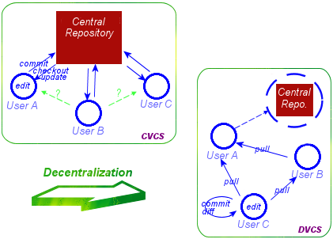

# Git
Gitとは、主にソースコード等の変更履歴を記録・追跡するための分散バージョン管理システム及びツールである。  
Linuxカーネルのソースコード管理のために、Linus Torvaldsによって開発された。  

ここでは、CVSからGitへ置き換えることを想定し、Gitで資源をリモートリポジトリへpushするまでの操作について記載する。  

1.  Git vs CVS/SVN 
2.  ローカルリポジトリの操作  
3.  リモート/ローカルリポジトリ(ブランチ)の操作

## GitとCVS/SVNのアーキテクチャの違い

|          | Git      | CVS/SVN |
|:--------:|:--------|:---------|
| アーキテクチャ | 分散型   | 中央集権型 | 
| バージョン番号 | SHA-1   | 自然数 | 
| チェックアウト | リポジトリ  | ファイル | 

### アーキテクチャ


#### 中央集権型
- ファイルをチェックアウトし、変更を行なう  
  - 同時に編集できるのは1人まで  

- ファイルの実体をリポートリポジトリで管理  
  - リモートリポジトリがダウンすると、ファイルが消える  
  - リモートリポジトリがダウンしたら、変更履歴も消える (人間の記憶と勘でマージする)

- 操作内容が直感的に理解しやすい

#### 分散型
- 各々がリポジトリを持ち、変更を行なう  
  - 同時に複数人が編集することができる

- ファイルの変更管理、メタ情報をリポジトリで管理  
  - リモートリポジトリがダウンしても、ファイルは消えない
  - 各々のリポジトリが変更履歴を持っているため、それを元に安全にマージすることができる

### チェックアウト
#### ファイル
- ファイル単位でチェックアウトし、変更を行なう　　
- 編集が終わったらコミット。コミット時にリモートリポジトリへ変更内容が反映される。  
  
#### リポジトリ
- `git fetch`と`git merge`により、**リポジトリ**をローカルへ反映　　
- `git commit`により、変更内容をローカルリポジトリへ反映　　
- 必要な改修が終わったら、`git push`により、**リポジトリ**をリモートへ反映する
  
### Exercise
- Gitをインストールしてください  
- インストールが完了したら、`git`コマンドを実行し、結果を確認してください  
- 任意のリモートリポジトリを`git clone`し、ローカルへリポジトリがダウンロードされることを確認してください  

## ローカルリポジトリの操作
Gitのチェックアウトはリポジトリ単位で行われる。  
ローカルリポジトリに対して、変更内容を反映し、それをリモートリポジトリへ反映することで、自分の変更を全員に共有する。  
Gitではリモートリポジトリに対して直接変更履歴を反映する操作を行なうことはできない。よってローカルリポジトリの操作を理解すれば、変更履歴をリポジトリへ反映するための操作は全て理解できたことになる。  

ここでは、既に作成されているリモートリポジトリをローカルへダウンロードし、変更をコミットし、リモートリポジトリへそれを反映するための操作について記載する。 

### git add
`git add`は、ある変更点を次回のコミットに含めるようgitに指示するコマンドである。  
この操作をGitでは`staging`と呼び、実体としてはGitの`index`へ変更内容を反映する操作となる。  

Gitでは全てのコミットが一意に保つことを推奨している。例えばある日のリリースで機能Aと機能Bをリリースする場合、機能Aと機能Bに依存関係がないのであれば、これらのコミットは分けたほうが良い。理由としては

- あとからコミットログを見た時に変更内容が分かりやすい
- 資源リリース時にどちらかの機能にバグが見つかった場合の部分リリースが用意になる

が挙げられる。

#### Exercise
- `git clone`したリポジトリの作業ディレクトリ上で、任意のファイルを変更し、`git add`して下さい。
 - `git add`が完了したら、`git reset`を使って、変更内容をステージングから破棄してください。  

### git rm
`git add`はあるファイルの変更をstagingするための操作である。`git rm`は、あるファイルを削除した時に、その操作をリポジトリへ反映する操作である。  

#### Exercise
- `git clone`したリポジトリの作業ディレクトリ上で、任意のファイルを`git rm`して下さい。

### git status
作業ディレクトリ上の変更一覧と、indexに反映されている変更を確認する際は`git status`コマンドを用いることで、これが実現できる。  

#### Exercise
- `git status`を実行し、自分が意図した通りに変更内容がstagingされていることを確認してください。  

### git commit
`git commit`は、stagingされた変更をリポジトリへ反映する操作である。実体としてはindexに反映された変更をobjectへ移動する操作である。  
commit時は、そのコミットの内容を表す任意のコメントを付与する。`git commit -m <message>`というように、オプション`-m`の後に、コメントを記述する。  

#### commitを間違えた場合
- 必要なファイルをstagingするのを忘れた  
  - `git ammend`
 
- 不要なファイルをstagingしてしまった  
  - `git reset --soft <commitid>`により、指定したcommit断面までロールバックできる  
    - ただし`git reset`はコミットログ自体を抹消するため、あるコミットが取り消されたこと自体がわからなくなる  
    - `git push`したコミットを対象にこれをやると、他の作業者に混乱を与える。**絶対にやらないこと**  

- `git revert  <commitid>`により、対象のcommitをロールバックするcommitをすることができる  
  - `git push`したコミットを戻す場合は、これを使用する
  
#### Exercise
- `git commit`を実行し、自分が意図した通りに変更内容がコミットされていることを確認してください。  
 - そのcommitをrevertし、別の変更を再度commitしてください。

### git log
`git log`により、コミットログを確認することができる。

## リモート/ローカルリポジトリ(ブランチ)の操作
`git commit`により、ローカルリポジトリへの変更内容の反映が完了した後は、それをリモートリポジトリへ反映する必要がある。  
Gitには**ブランチ**と呼ばれる、履歴の流れを分岐して記録する機構が存在する。  
ここで記載するリモート/ローカルリポジトリの操作は、厳密にはリモート/ローカルリポジトリのブランチの操作である。  

Gitには`master`ブランチがデフォルトで存在する。ブランチを新たに作成しないのであれば、全ての変更はこのmasterブランチ上で行われることになる。  
ブランチは非常に強力な機構であり、Git採用の大きなメリットでもある。`master`ブランチのみでの運用が辛くなってきたら、ブランチを使ったワークフローを定義することが推奨される。  

### git push
`git push <リモートリポジトリ名> master`により、ローカルリポジトリ上のmasterブランチの変更をリモートリポジトリのmasterブランチへ反映することができる。

#### Exercise
- `git push`を用いて、ローカルリポジトリの変更をリモートリポジトリへ反映してください

### git fetch
`git fetch <リポジトリ名>/master`により、リモートリポジトリ上のmasterブランチの**変更履歴**をローカルリポジトリへ反映することができる。  

### git merge
ローカルリポジトリへ反映された変更履歴をファイルへ反映するためには`git merge <リポジトリ名>/master`を使用する。  

#### Exercise
以下の操作を行ってください。

1.  作業ディレクトリAと作業ディレクトリBを作成
2.  A,Bへリモートリポジトリを`git clone`する
3.  Aで任意の変更をcommit&pushする
4.  B上で、3の変更履歴を`git fetch`する
5.  B上で`git log`を実行し、3の変更履歴が保存されていることを確認する
6.  B上で`git merge`を使用し、変更履歴をファイルへ反映する

### よくあるトラブル/エラー
メッセージを見れば、何をすればいいのかはすぐに理解できる。  

#### pushがrejectされる
リモートリポジトリのブランチが保持する変更履歴の中に、リモートリポジトリへ反映されていないものが存在するため。  
Gitではpushの際に、リモートリポジトリのブランチが保持する全ての変更履歴がローカルリポジトリのブランチへ反映されていることを前提とすることで、デグレを防ぐ。  

エラーメッセージは以下の通り  
```
% git push origin master
To https://github.com/xxxx/xxxxx.git
 ! [rejected]        master -> master (fetch first)
error: failed to push some refs to 'https://github.com/xxxx/xxxxx.git'
hint: Updates were rejected because the remote contains work that you do
hint: not have locally. This is usually caused by another repository pushing
hint: to the same ref. You may want to first integrate the remote changes
hint: (e.g., 'git pull ...') before pushing again.
hint: See the 'Note about fast-forwards' in 'git push --help' for details.
```

### git mergeできない
`git merge`をする際は、対象の作業ディレクトリ上で、commitされていない変更が存在しないことが前提である。  

エラーメッセージは以下の通り
```
error: Entry '<fileName>' not uptodate. Cannot merge. (Changes in working directory)
```

```
error: Entry '<fileName>' would be overwritten by merge. Cannot merge. (Changes in staging area)
```

### git mergeでコンフリクトが発生
mergeするブランチAと、merge対象のブランチBが保持する変更内容のうち、同一ファイルの同一箇所で異なる変更が発生している場合。  
どちらの変更が正しいのかを確認し、それをcommitする必要がある。  

```
 # Changes to be committed:
  #   (use "git reset HEAD <file>..." to unstage)
  #
  #	modified:   <Some file>
  #
  # Changed but not updated:
  #   (use "git add <file>..." to update what will be committed)
  #   (use "git checkout -- <file>..." to discard changes in working directory)
  #
  #	unmerged:   <file>
  #
```

対象ファイルには、以下のようなエラーメッセージが書き込まれる。

```
 <<<<<<< HEAD:mergetest
 This is my third line
 =======
 This is a fourth line I am adding
 >>>>>>> 4e2b407f501b68f8588aa645acafffa0224b9b78:mergetest
 ```
 
 対処方法は以下の2つ。
 
 1. 対象ファイルを手動で変更し、commit&pushする
 2. `git checkout --ours <対象ファイル>`で自分の変更を優先するか、`git checkout --theirs`でリモートリポジトリの変更を優先し、commit&pushする
 
## Git管理者
以上が、Gitを用いたバージョン管理(masterブランチのみ/リモートリポジトリが作成済み)に必要な最低限の操作である。  

これらに加えて、Gitの管理者は以下の操作を理解する必要がある。
- Gitサーバーの構築
- Gitワークフローの定義
- Gitツールの選定
- Git hookの仕込み

ここではGitサーバーの構築について記載する。残りの項目については管理者が調査し、チーム内での共有と合意を行って頂く。  

### Gitサーバーの構築
GitはSSH/HTTP/HTTPS/SMBに対応している。  

1. リモートリポジトリとするディレクトリ上で、`git init --bare --shared`を実行し、リモートリポジトリを作成
2. 接続に必要な情報を確認し、メンバーへ展開。`git clone`の引数として何を設定するのかを通知する

リモートリポジトリが削除されたりサーバーがダウンした場合は、リモートリポジトリを再作成し、各メンバーのリポジトリをpushすることで整合性を取る必要がある。

## Githubについて
GithubはGitサーバーを提供するWebサービスである。  
Gitサーバー以外の主な機能としては

- Wiki機能
- markdownのサポート
- Jenkins,TravisCI,CircleCIなどとの連携機能
- Pull Requestをベースとしたワークフロー

が挙げられる。コードレビューをする際にメールで行数を指定して内容を指示することがしばしばあるが、はっきり言って前時代的なので、必要であればGithub,GitLab,Gitbucket等のサービス,ソフトウェアを利用することを検討するべきである。 
