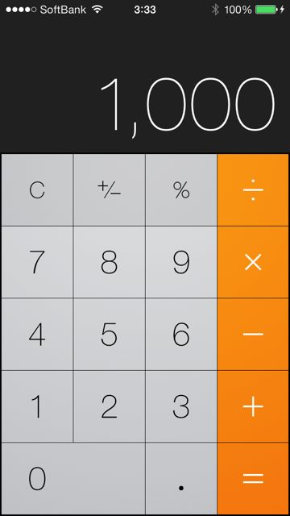

# Twitter Bootstrap
Twitter Bootstrapは、Twitter社が開発したMITライセンスのHTML/CSS/Javascriptフレームワーク、ライブラリである。  
特徴として、簡潔性、フラットデザイン、レスポンシブデザインのサポートが挙げられる。多くの商用サイトが、Twitter Bootstrapを用いており、最も採用実績が多いライブラリの１つである。

## フラットデザイン以前
AppleやMicrosoftに限らず、全世界のデザイナーが考えている問題として、**ディスプレイ上で直感的に理解しやすく、かつ高機能なUIはどのように設計するべきか**というものがある。この問題に対して、Appleはまずスキュアモーフィックデザインを提唱した。

スキュアモーフィックデザインの主な特徴としては
- 視覚的にリッチ
- 現実世界の事物、質感をディスプレイ上で再現
と言うものが挙げられる。上記の電卓の例では、ボタンに立体感と隙間を与えることで、現実の電卓をディスプレイ上で表現し、それが直感的な理解に繋がるということが伺える。  

一方でこのデザインには、多大な工数とスキルが必要であった。換言すれば、デザイナーを自社に大量に抱えているような大企業や、デザイナー事務所にしか、こういった(電卓程度でさえ)アプリケーションを作ることができなかったという側面が存在した。  

AppleやGoogle、Microsoftといった会社は、最終的には自社のプロダクトが日常のあらゆるインターフェースを置き換えることを狙っている。実際にAppleはMacというPCからiPod、iPhone、Apple TV、HomeKitなど、自社のプロダクトの幅を拡大する路線を取り続けている。この際に重要となるのが、すべてのデバイスで統一的に使える、ユニバーサルデザインが必要となることである。製品毎にUIを根本から再設計する必要があるスキュアモーフィックデザインには、こうしたデザイン戦略上で課題があった。  

そこでAppleとMicrosoftが、iOS7とWindows8にて提唱したのが**フラットデザイン**である。  

## フラットデザイン

フラットデザインの主な特徴としては
- グラデーションやテクスチャの排除
- 立体感の排除
- 背景色の違いや境界線で違いを示す
- 最低限の視覚表現で、強調表現する
といったものが挙げられる。

これにより、**Webサイトやアプリケーションのデザインの工数と難易度が格段に下がり、ある程度のスキルが有ればこうしたデザインが可能になった**という変化が起きた。換言すれば、iOSアプリやWindowsアプリの開発者は、デザイナーを雇わなくても、完成度の高いアプリケーションをリリースすることが可能になったということである。  

このデザインの普及は、世の中の「使いづらい」Webサイトやアプリケーションを悪い意味でより一層際立たせることになった。機能的には優れていても、デザインが直感的に理解し辛い、使いにくいというだけでユーザーはそれを使うことを辞めてしまう割合が増えたということができる。Appleの製品は、Apple社がリリースしているガイドラインやライブラリを使うことで、この点を簡単にクリアすることができる。従ってAppleのアプリケーションの完成度が相対的に高く評価され、それがiPhoneの売上に繋がったと推測される。

こうした潮流において、従来はデザインが軽視されてきた業務用アプリケーションにおいても、デザインが重要視されるケースが増えてきている。またコンサルティングファームであるマッキンゼーやボストンコンサルティンググループがデザインファームを買収するなど、**UI/UX**の重要性が高まっている傾向にある。  

## レスポンシブデザイン
フラットデザインにより、直感的に理解しやすい(とされる)UIデザインの敷居が下がり、世界中のWebサイトやアプリケーションのデザインが改善されたことにより、ユーザーが暗黙的に期待するデザインへの期待度が以前より高まった。これまではデザインが軽視されてきた業務アプリケーションにおいても、これを無視できないレベルにまで達しすつある。  

フラットデザインと同様に、無視することができない要素が、デバイスの多様化である。iPhone等のスマートフォンやSurfaceのようなタブレットは、PCとは異なり、無線通信環境の使用(=しばしばオフラインになる)やディスプレイの縦横比の多様化をもたらした。デザインに対する期待度が上がっている傾向において、PCのみに最適化されたWebサイトは、スマートフォンやタブレットからは使われなくなってしまう。  

このうち、ディスプレイの縦横比の多様化に対するソリューションは、以下の2つが上げられる。

1.  スマホ/タブレット用にHTMLを別途作る
2.  レスポンシブデザインにより、１つのHTMLで全てのデバイスに対応する

この手法1については、ディスプレイサイズに応じた柔軟なレイアウト変更が実現できる。実際にこのアプローチを用いているサイトやアプリケーションは多数存在する。これの欠点は、作成するHTMLの数が増える=工数の増大である。  
これに比して、レスポンシブデザインは単一のHTMLですべての縦横比に対応するアプローチである。これは柔軟性はある程度欠けるものの、工数が節約できる。  

Twitter Bootstrapは、このレスポンシブデザインとフラットデザインをサポートしつつ、ある程度は柔軟なレイアウト変更を実現することを目的とし、Twitter社により開発及びリリースされた。

## Twitter Bootstrap
### Twitter Boostrapのフラットデザイン
Twitter Bootstrapはデフォルトでフラットデザインをサポートしている。このライブラリが提供するコンポーネントを普通に使えば問題ない。

### Twitter Bootstrapのレスポンシブデザイン
(ここで力尽きたので、一旦ここまで)

